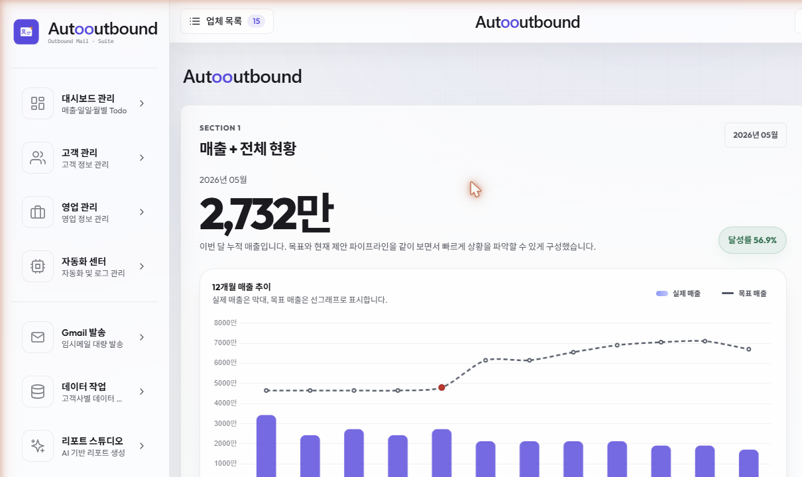
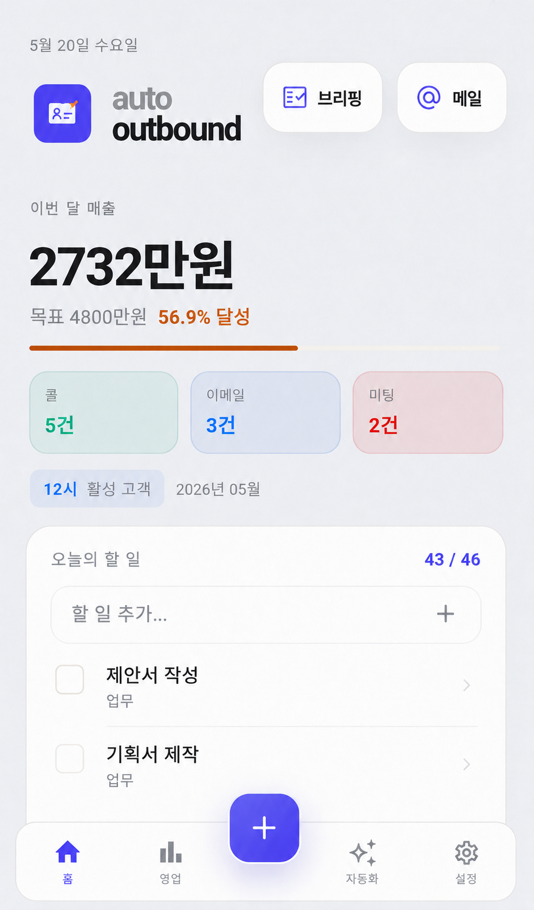
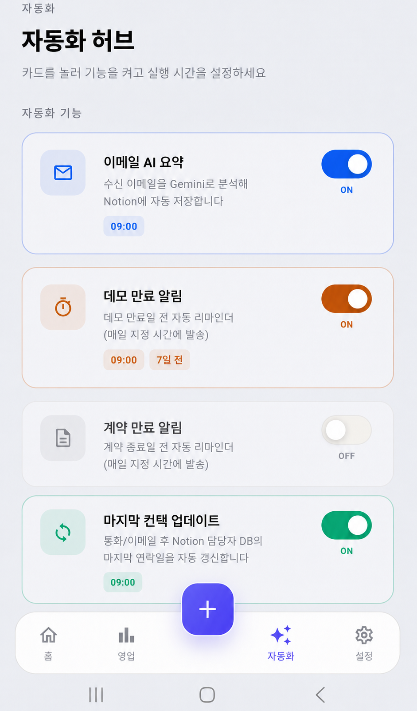
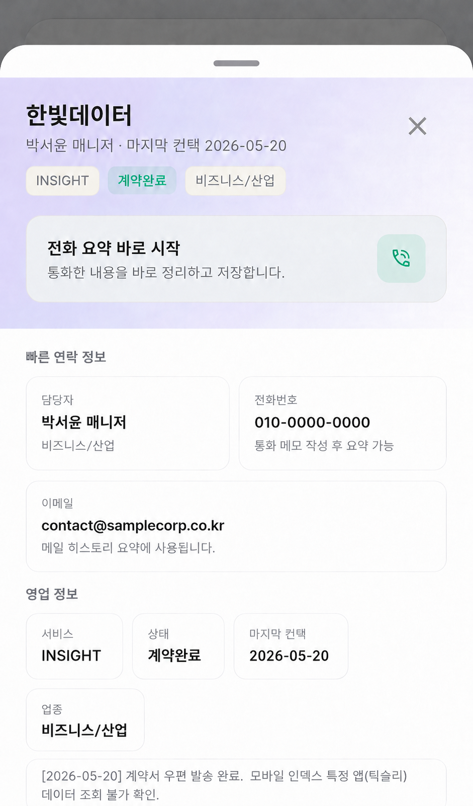

# Autooutbound — 영업 자동화 시스템

> AI 기반 이메일 요약 · 영업/고객 관리 · 자동 리포트  
> Web + Android 앱으로 영업의 모든 흐름을 자동화합니다.

## 🔗 데모

👉 **[서비스 소개서 웹 버전](https://ryan-manhattan.github.io/autooutbound-intro/)**

📄 [서비스소개서 PDF 다운로드](./서비스소개서.pdf)

📱 [Android APK 다운로드 (Releases)](https://github.com/Ryan-manhattan/autooutbound-intro/releases)

---

## 주요 기능

| 기능 | 설명 |
|------|------|
| 📧 이메일 AI 요약 | Gmail 수신 메일을 자동 분류·요약하여 핵심만 전달 |
| 📊 매출·고객 대시보드 | 실시간 영업 현황, 고객 상태, Todo 관리 |
| 🤖 자동 아웃바운드 메일 | 시장 데이터 기반 맞춤 영업 메일 자동 생성·발송 |
| 📑 리포트 스튜디오 | 원클릭 고객 리포트 생성 (HTML/PDF) |
| 🔔 실시간 알림 | FCM 기반 푸시 알림으로 중요 이벤트 즉시 전달 |

---

## 기술 스택

**Backend** — Python · Flask · Supabase (PostgreSQL + Auth + Storage)  
**Frontend** — Flutter (Android) · Jinja2 Templates (Web)  
**AI/ML** — Google Gemini API  
**Infrastructure** — Google Cloud Run · Cloud Scheduler · Gmail API · Notion API  
**Data** — Mobile Index API · 자체 데이터 파이프라인

---

## 스크린샷

### Web Dashboard

### App Screens
| Home | Sales | Automation | Detail |
|------|-------|------------|--------|
|  |  |  |  |

---

## 연락처

- GitHub: [@Ryan-manhattan](https://github.com/Ryan-manhattan)

---

## License

This project is proprietary. All rights reserved.
